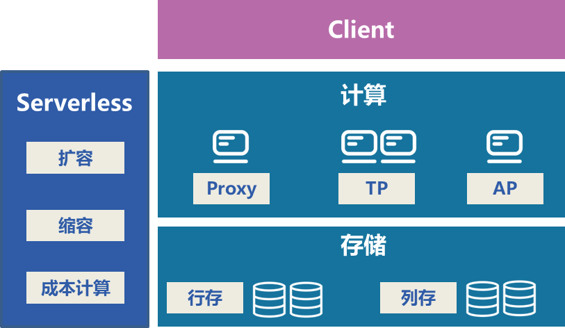

# Serverlessdb-for-HTAP

  ## Introduction

  ​      ServerlessDB for HTAP is a serverless db service based on TiDB on the cloud, focusing on how to dynamically scale up and down the compute storage nodes based on business load changes to achieve zero user perception. To ensure that the database service process, always maintain the best match between business load and background resources, thus helping users to maximize cost savings.

  ## Feature

  - Dynamic scaling based on business load to ensure continuous and stable business with zero user perception.
  - The service load model can differentiate between AP and TP services, ensuring that AP and TP services do not affect each other.
  - Always ensure that the load on each computing node is balanced and kept within a reasonable range.
  - Supports ultra-small form factor compute nodes and ensures smooth transition from ultra-small to large form factor.

  ## Architecture

  ​	In order to implement tidb serverless, we designed the proxy module and serverless module. The proxy module does permission control, computation under low load, and traffic forwarding under high load, while the serverless module mainly manages tidb-server instances and smoothly scales tidb-server.

  

  ## Getting Started

  [handbook](./docs/handbook.md)

  ## Code of Conduct

  This project is for everyone. We ask that our users and contributors take a few minutes to review our [Code of Conduct](./code-of-conduct.md).

  ## License

  ServerlessDB for HTAP is under the Apache 2.0 license. See the  file for details.

